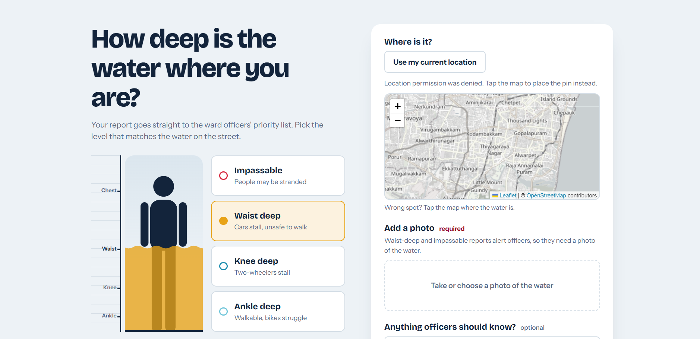
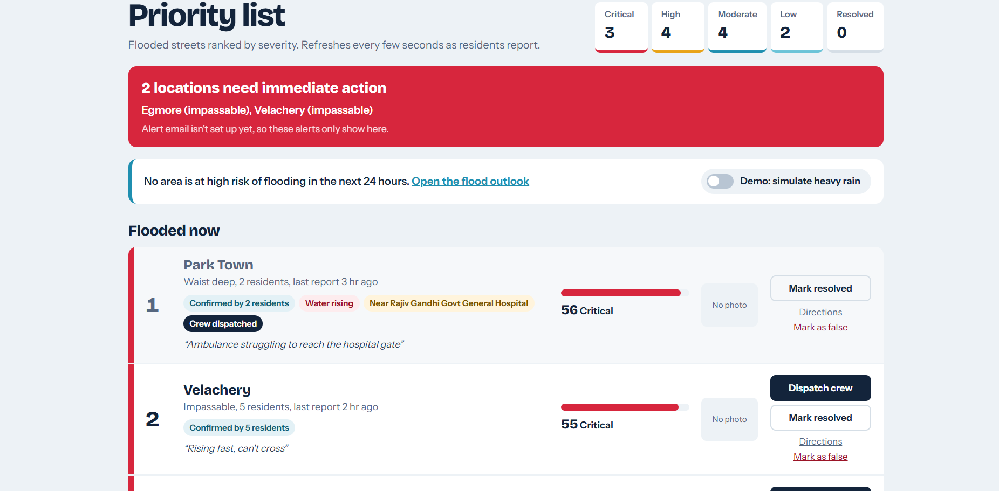
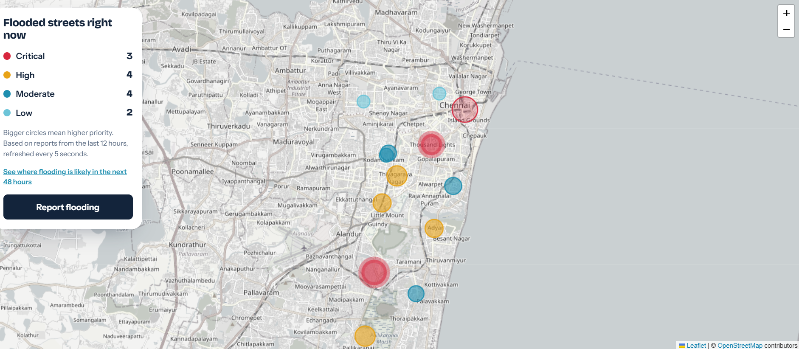
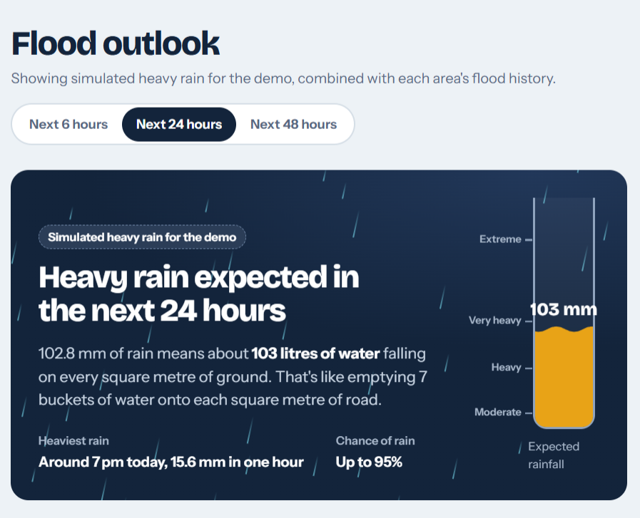
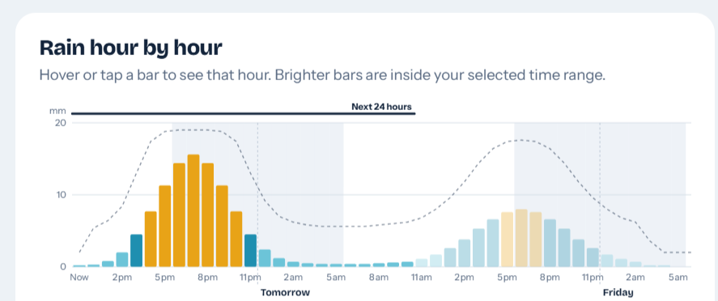
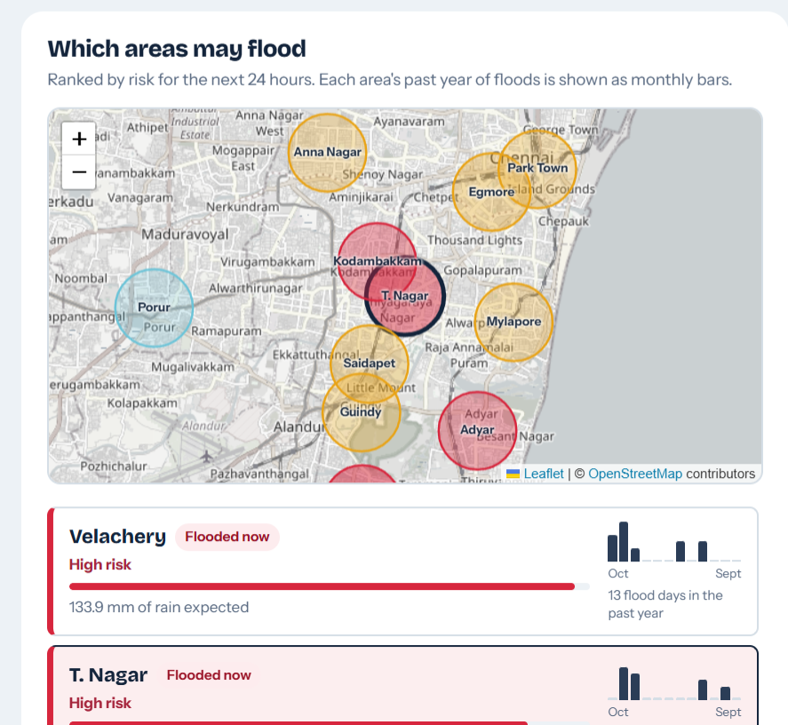
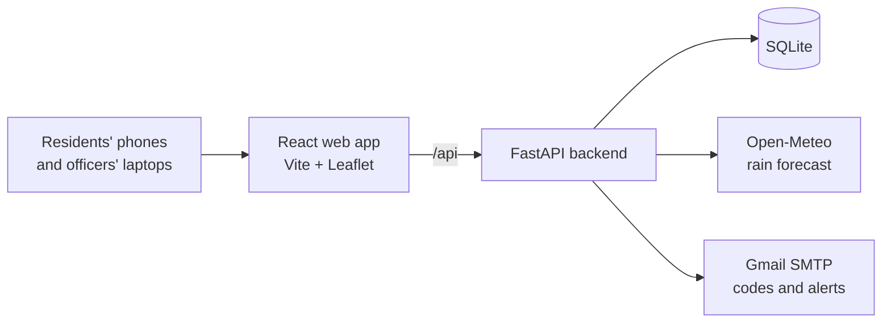

# Vellam: live street flooding for Chennai

**Residents report how deep the water is. Vellam ranks every flooded street by severity. Officers fix the worst ones first.**

*Vellam (வெள்ளம்) means "flood" in Tamil.*

**Team The Predators:** Sunil Kumar S, Tanveerul Asfaq, Vikram Srivatsan Murthy

> **Pitch deck:** [docs/Vellam_pitch.pptx](docs/Vellam_pitch.pptx)
> **Run it yourself in about 5 minutes:** see [Getting started](#getting-started) and the [demo walkthrough](#demo-walkthrough).



---

## Problem statement

During Chennai's monsoon floods, residents have no simple way to report how badly their street is flooded, and authorities have no verified, prioritised view of which streets need help first.

Complaints arrive scattered across phone calls, WhatsApp forwards and social media. In that pile, an ankle-deep puddle and a street where people are stranded look exactly the same, so response is slow, unordered, and usually starts only after streets are already under water.

- **Who's affected:** residents, commuters, and ambulances and crews trying to reach homes and hospitals.
- **The gap:** no real-time, verified, street-level picture of flooding, and no warning of where it will flood next.
- **Our goal:** let residents report in seconds, rank every flooded street by severity, alert officials to critical locations, and forecast which areas may flood.

## What Vellam does

| Feature | What it means |
|---|---|
| **Report in seconds** | Residents pick the water depth on a visual gauge (ankle, knee, waist, impassable), pin the spot using GPS or by tapping the map, and optionally add a photo and note. No sign-up needed. |
| **Live flood map** | Every flooded street appears on a map, colour-coded and sized by priority, refreshing every 5 seconds. |
| **Priority ranking** | Nearby reports are grouped into ~110 m areas and scored by depth, number of residents, nearby hospitals or schools, and whether the water is rising. |
| **Officer dashboard** | A live priority list with one-click *Dispatch crew*, *Mark resolved* and *Mark as false*, plus directions to each spot. |
| **Instant alerts** | Critical locations raise a red alert banner and send an email to the ward office. |
| **Fake-report protection** | One phone counts once per spot, reports are rate-limited, severe reports need a photo, and single-reporter spots are marked *Unverified*. |
| **Secure officer sign-in** | Only approved emails can sign in, using a 6-digit code that expires in 10 minutes. Officer actions are enforced on the server. |
| **Flood outlook** | A public page forecasting which areas may flood in the next 6, 24 or 48 hours, based on live rainfall forecasts and each area's flood history. |

## Screenshots

**Officer dashboard:** ranked flooded streets, trust tags and one-click actions.



**Live map:** every flooded street, sized and coloured by priority.



**Flood outlook:** the forecast explained in plain language, hour by hour, and area by area. (Shown here with the built-in heavy-rain simulation used for demos.)







## Demo walkthrough

Follow these steps after [getting started](#getting-started) to see the full flow in about 3 minutes.

1. **Open two windows side by side:** the **Live map** (`/#map`) on the left and the **Officer dashboard** (`/#dashboard`, signed in as `officer@test.com`) on the right.
2. **Report as a resident:** in a third tab, open **Report flooding**, choose **Impassable**, tap the map next to Government Royapettah Hospital, add any photo, and send.
3. **Watch the response:** within 5 seconds the new spot appears on the map, jumps near the top of the priority list as **Critical** (impassable + next to a hospital), and the red alert banner appears.
4. **Act as an officer:** click **Dispatch crew**, then **Mark resolved**. Try **Mark as false** on another spot to see it removed.
5. **Test fake-report protection:** report the same spot again from the same browser. You'll see *"Report updated"* instead of a second report being counted.
6. **See the flood outlook:** on the dashboard, turn on **Demo: simulate heavy rain**, then open **Flood outlook** and switch between the 6, 24 and 48-hour views. Hover over the hourly chart and click an area to see why it's at risk.

## How the priority score works

Every report from the last 12 hours within the same ~110 m area counts towards one hotspot. Its score is:

| Factor | Points |
|---|---|
| Water depth (deepest report) | Ankle 10, knee 20, waist 30, impassable 40 |
| Residents reporting | +3 per *different* resident, up to 10 (repeats from one phone count once) |
| Hospital or school within 500 m | +15 |
| Water rising (latest report deeper than the first) | +5 |

| Level | Score | What happens |
|---|---|---|
| Critical | 40+ | Alert banner and email to officers |
| High | 28–39 | |
| Moderate | 16–27 | |
| Low | Under 16 | |

**Example:** impassable water (40) next to a hospital (+15), reported by one resident (+3) = **58, Critical**.

All weights and thresholds live in [`backend/config.py`](backend/config.py), so a city could tune them.

## How the flood outlook works

For each of 14 Chennai localities:

1. **Rain:** the hourly rainfall forecast from [Open-Meteo](https://open-meteo.com): total rain over the chosen time range and the heaviest hour.
2. **History:** how many days the area flooded in the past year (from stored reports), plus whether it's known to be low-lying.
3. **Risk = rain × history.** Heavy rain over an area that floods often means high risk. Streets that are flooded right now raise it further.

Every area comes with a plain-language reason, for example: *"Heavy rain expected (106 mm in the next 24 hours). Flooded on 7 days in the past year. Low-lying, flood-prone area."*

This is a **transparent risk formula, not a trained machine-learning model**, so every warning can be explained. The flood history in the demo is simulated and concentrated in October to December, matching Chennai's northeast monsoon. Training a model on real historical flood records is the next step.

Rainfall totals are also explained in everyday terms: 1 mm of rain is 1 litre of water per square metre, so 103 mm means about 103 litres on every square metre of ground. Categories follow the India Meteorological Department's rainfall bands.

## Architecture



The React dev server forwards `/api` and `/uploads` to FastAPI, so the whole app runs from one address, which also lets a single ngrok tunnel serve it to a phone over https (needed for GPS).

## Tech stack and open-source tools

| Area | Used |
|---|---|
| **Languages** | Python, JavaScript (JSX), HTML, CSS, SQL |
| **Backend** | FastAPI, Uvicorn, Pydantic, python-multipart, SQLite |
| **Frontend** | React 18, Vite, Leaflet, React-Leaflet |
| **Maps and weather data** | OpenStreetMap, Open-Meteo API |
| **Services** | Gmail SMTP (sign-in codes and alerts), ngrok (https tunnel for the phone demo) |
| **Developer tools** | VS Code, Node.js and npm, pip and venv, Git and GitHub |

Everything in the Backend, Frontend and Maps rows is open source or open data.

## Project structure

```
vellam/
├── backend/
│   ├── main.py            # FastAPI app and all API routes
│   ├── config.py          # All settings: scoring weights, officer emails, email, localities
│   ├── scoring.py         # Groups reports into hotspots and calculates priority scores
│   ├── forecast.py        # Flood outlook: rain forecast x flood history
│   ├── auth.py            # Officer sign-in with 6-digit email codes
│   ├── email_alert.py     # Sign-in code and critical-alert emails
│   ├── db.py              # SQLite schema and migrations
│   ├── seed.py            # Loads demo reports and a year of flood history
│   └── requirements.txt
├── frontend/
│   ├── src/
│   │   ├── views/         # Report, Live map, Flood outlook, Officer dashboard, Sign-in
│   │   ├── components/    # Depth gauge, location picker, rain gauge, hourly chart, area outlook
│   │   ├── api.js         # API client
│   │   └── styles.css
│   ├── package.json
│   └── vite.config.js     # Dev server and API proxy
└── docs/
    ├── Vellam_pitch.pptx
    └── screenshots/
```

## Getting started

**You need:** Python 3.10+ and Node.js 18+.

### 1. Backend (terminal 1)

```bash
cd backend
python -m venv venv
venv\Scripts\activate          # Windows
# source venv/bin/activate     # macOS / Linux
pip install -r requirements.txt
python seed.py                  # loads demo data (safe to re-run; it resets the data)
uvicorn main:app --reload
```

API docs are then at http://localhost:8000/docs.

### 2. Frontend (terminal 2)

```bash
cd frontend
npm install
npm run dev
```

Open **http://localhost:5173**.

| Page | Address | Access |
|---|---|---|
| Report flooding | `/#report` | Public |
| Live map | `/#map` | Public |
| Flood outlook | `/#outlook` | Public |
| Officer dashboard | `/#dashboard` | Officer sign-in |

### 3. Sign in as an officer

1. Go to **Officer sign-in** and enter `officer@test.com` (a demo account listed in `OFFICER_EMAILS` in `backend/config.py`).
2. The 6-digit code is printed in the **backend terminal**, in a line starting with `[auth] sign-in code`.
3. Enter the code.

To see the flood outlook with heavy rain, sign in and turn on **Demo: simulate heavy rain** on the dashboard. The switch resets when the backend restarts.

### Optional: email

To send sign-in codes and alerts by email, create a [Gmail app password](https://myaccount.google.com/apppasswords) and set these environment variables before starting the backend (or fill them into `backend/config.py` locally, without committing them):

```powershell
# Windows PowerShell (same terminal, before uvicorn)
$env:VELLAM_SMTP_USER="you@gmail.com"
$env:VELLAM_SMTP_PASSWORD="your16characterapppassword"
$env:VELLAM_ALERT_TO="ward-office@example.com"
```

```bash
# macOS / Linux
export VELLAM_SMTP_USER="you@gmail.com"
export VELLAM_SMTP_PASSWORD="your16characterapppassword"
export VELLAM_ALERT_TO="ward-office@example.com"
```

### Optional: try it on a phone

Phones only share GPS with https sites. With both servers running:

```bash
ngrok http 5173
```

Open the `https://….ngrok-free.app` link on the phone.

## API

| Method | Endpoint | Access | Purpose |
|---|---|---|---|
| POST | `/api/reports` | Public | Submit a report (depth, location, optional photo and note) |
| GET | `/api/hotspots` | Public | Ranked hotspots with scores and summary counts |
| GET | `/api/forecast` | Public | Flood outlook for the next 6, 24 and 48 hours |
| POST | `/api/auth/request-code` | Public | Send a sign-in code to an approved officer email |
| POST | `/api/auth/verify` | Public | Exchange the code for a session token |
| GET | `/api/auth/me` | Officer | Check the current session |
| POST | `/api/auth/logout` | Officer | End the session |
| GET | `/api/alerts` | Officer | Active critical alerts |
| POST | `/api/hotspots/{id}/status` | Officer | Mark open, dispatched or resolved |
| POST | `/api/hotspots/{id}/false` | Officer | Flag a hotspot's reports as false |
| POST | `/api/forecast/simulate` | Officer | Turn simulated heavy rain on or off (demo) |

## Security and privacy

- **Residents don't create accounts.** Each browser gets an anonymous ID, used only to stop duplicate reports and to rate-limit. Vellam stores the location, depth, optional note and photo, nothing else.
- **Officer access** is limited to approved emails. Codes are stored hashed, expire after 10 minutes, and lock after 5 wrong attempts. Sessions last 12 hours, and every officer action is checked on the server.
- **No secrets in the code.** Email credentials are read from environment variables.
- Printing sign-in codes in the terminal (`PRINT_CODES_IN_TERMINAL`) is a demo convenience and should be turned off in a real deployment.

## Future work: a government-connected rollout

**Phase 1: Ward pilot with Greater Chennai Corporation**
- Pilot in one flood-prone ward, such as Velachery
- Officers sign in with official government email addresses
- Reports flow into the corporation's complaint system

**Phase 2: Connect government data**
- Add India Meteorological Department (IMD) rainfall warnings to the flood outlook
- Train a prediction model on the city's historical flood records
- Share live hotspots with the Tamil Nadu State Disaster Management Authority (TNSDMA) and emergency services

**Phase 3: Citywide and for everyone**
- Report through WhatsApp and SMS, in Tamil and English
- AI photo check to estimate water depth and catch fake images
- Scale on PostgreSQL and PostGIS in a government cloud

*Greater Chennai Corporation, TNSDMA and IMD are proposed partners; Vellam is not currently affiliated with them.*

## Team: The Predators

- Sunil Kumar S
- Tanveerul Asfaq
- Vikram Srivatsan Murthy

## Acknowledgements

- Map data © [OpenStreetMap](https://www.openstreetmap.org/copyright) contributors
- Weather data by [Open-Meteo.com](https://open-meteo.com) (CC BY 4.0)
- Built with FastAPI, React, Vite and Leaflet
